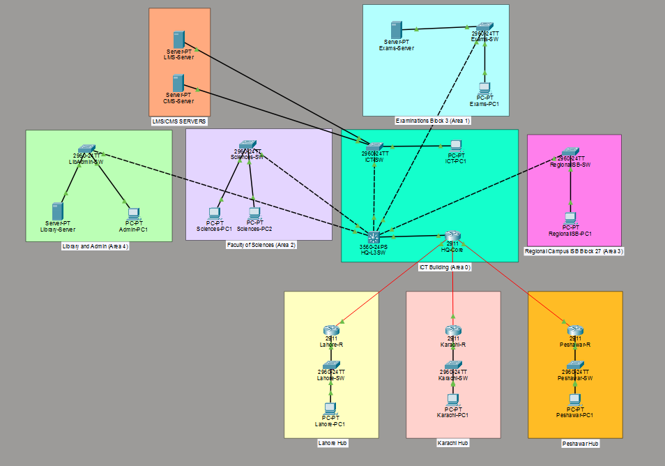
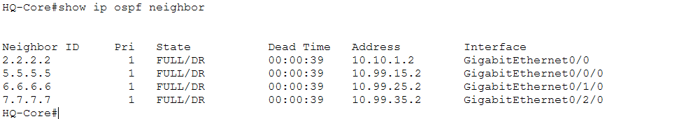
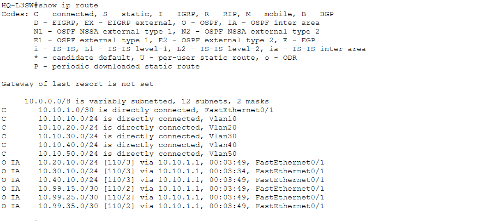
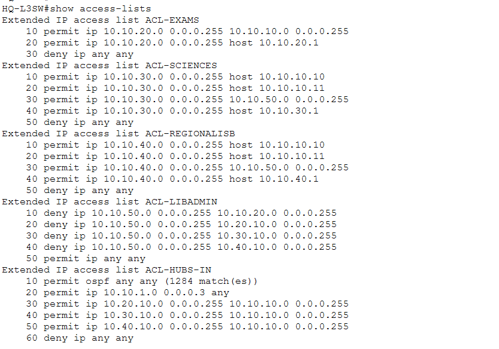
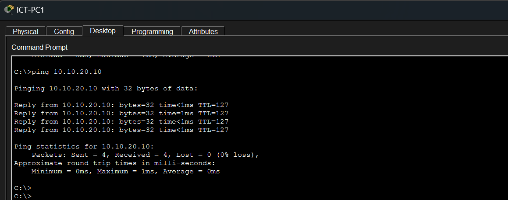
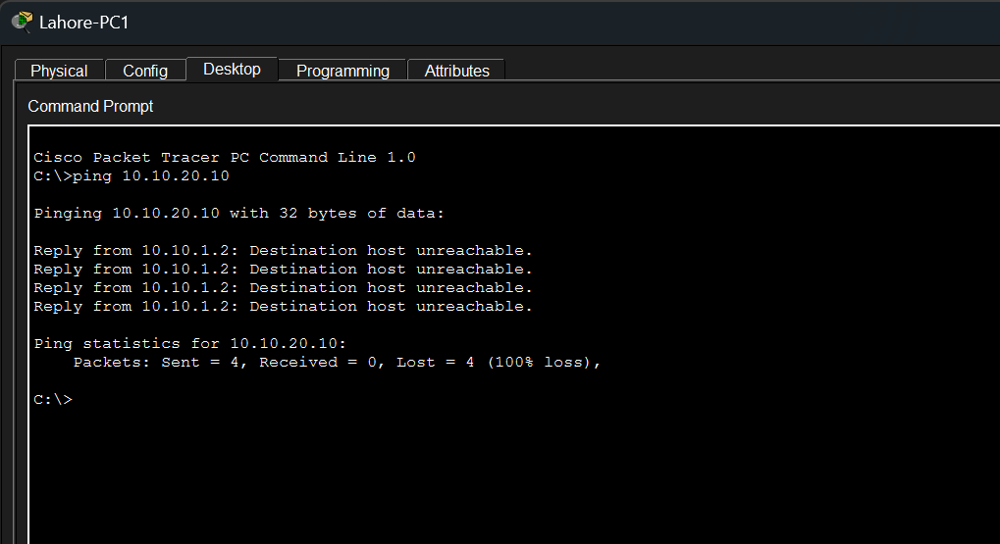
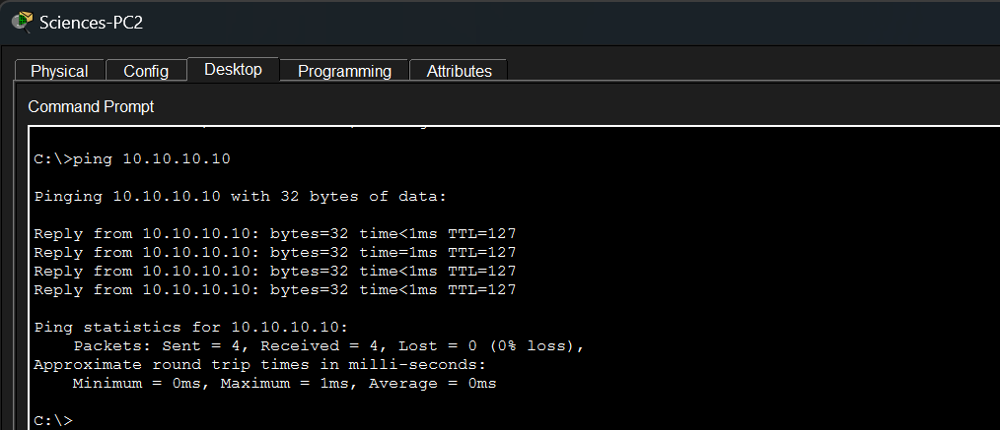

# AIOU Campus & WAN Network: Multi-Area OSPF with ACL Security

A university network built in Cisco Packet Tracer, modeled on Allama Iqbal Open University (AIOU): a main campus at H-8, Islamabad, connected to three regional hubs over a routed WAN, with department-level access control enforced through extended ACLs.

## Topology

**Headquarters (H-8 campus)** — five OSPF areas mapped to the real organizational structure:

| Area | Department | Devices |
|---|---|---|
| 0 | ICT Building (backbone) | HQ-Core, HQ-L3SW, ICT-SW, LMS-Server, CMS-Server, ICT-PC1 |
| 1 | Examinations (Block 3) | Exams-Server, Exams-PC1 |
| 2 | Faculty of Sciences | Sciences-PC1, Sciences-PC2 |
| 3 | Regional Campus Islamabad (Block 27) | RegionalISB-PC1 |
| 4 | Library and Admin | Library-Server, Admin-PC1 |

**Regional hubs** — each its own OSPF area, connected to HQ-Core over a routed WAN link:

| Area | Hub |
|---|---|
| 5 | Lahore |
| 6 | Karachi |
| 7 | Peshawar |

HQ-L3SW is a Layer 3 switch performing inter-VLAN routing via SVIs and enforcing the ACL policy for every department. HQ-Core connects the campus to the three hubs.

## Access Policy

Enforced with extended ACLs on HQ-L3SW:

- **Examinations** is reachable only from the ICT Directorate. All other departments and all regional hubs are explicitly denied.
- **Faculty of Sciences** and **Regional Campus Islamabad** can reach the LMS/CMS servers and the Library, and are denied everything else.
- **Library/Admin** is denied access to Examinations and to the regional hubs.
- **Regional hubs** are limited to the ICT subnet via an inbound ACL on the HQ-L3SW uplink (`ACL-HUBS-IN`).
- OSPF is explicitly permitted on that same uplink ACL, so the routing adjacency isn't broken by the policy.

## Verification

**OSPF adjacencies** — all FULL across HQ-Core, HQ-L3SW, and the three hub routers.

**Inter-area routing** — hub subnets appear correctly as `O IA` routes on HQ-L3SW.

**ACL enforcement** — match counters confirm the deny/permit rules are actually being hit, not just defined.

**Connectivity tests:**

| From | To | Result |
|---|---|---|
| ICT-PC1 | Exams-Server | Allowed |
| Lahore-PC1 | Exams-Server | Blocked |
| Sciences-PC2 | LMS-Server | Allowed |

## Lessons Learned

The first version of this configuration had correctly written ACLs that were never bound to any interface — `show ip interface vlan20` showed "Inbound access list is not set" even though `show access-lists` listed every rule as expected. The network was fully open until this was caught through testing. It was a useful reminder that a config which reads correctly still needs to be verified for actual behavior, not assumed from the ACL definitions alone.

## Limitations

- No VPN/IPsec is configured on the WAN links — traffic between HQ and the hubs is plain routed OSPF.
- Traffic between hubs (e.g. Lahore to Karachi) never passes through HQ-L3SW, so it isn't restricted by this policy. Filtering it would require ACLs on HQ-Core.
- The ACLs are stateless, so the hub-to-HQ policy permits the whole ICT subnet rather than only the LMS/CMS servers specifically.

## Files

- `aiou-network.pkt` — the Packet Tracer file
- `/screenshots` — verification screenshots referenced above
- `demo-acl-enforcement` — short video demonstrating the ACL policy in action

## Author

Ibraheem

## License

Open for academic and learning purposes.
